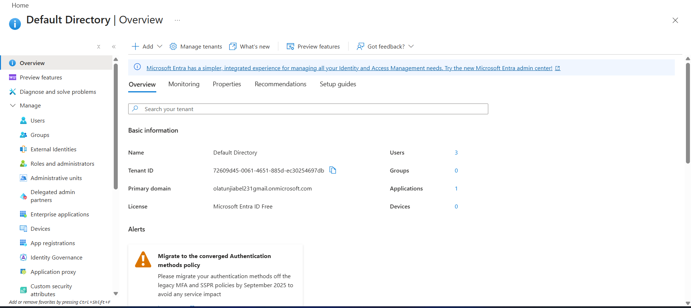
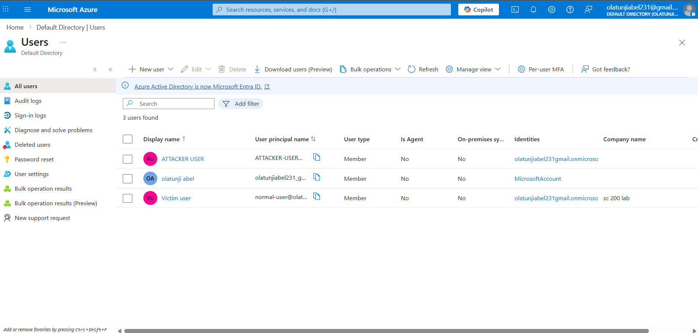
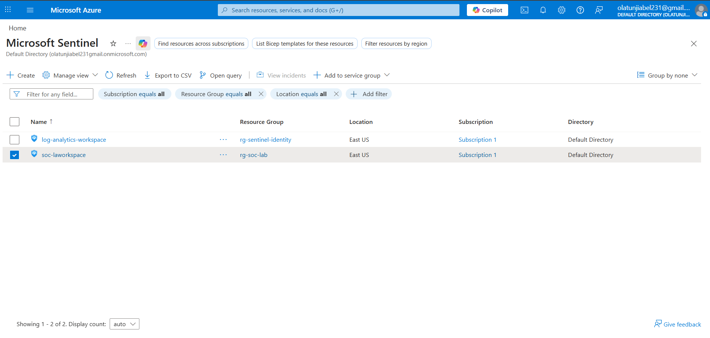
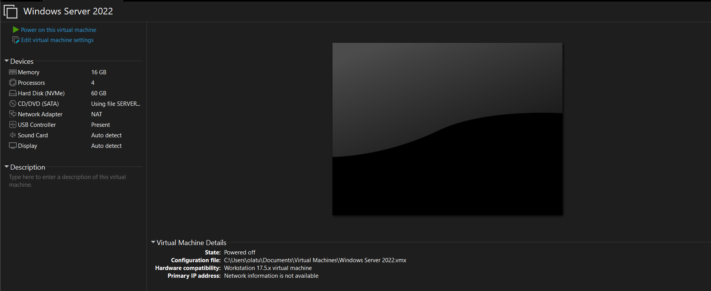
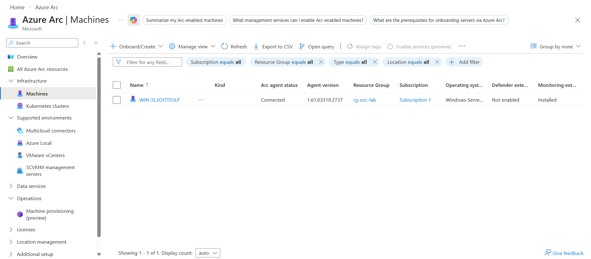
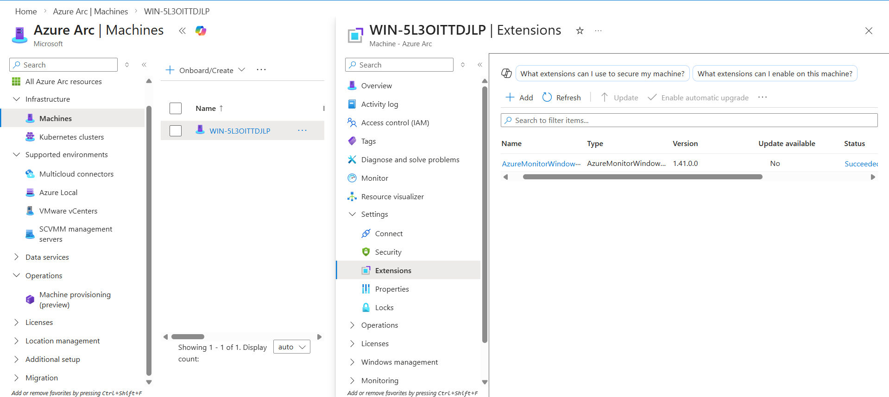
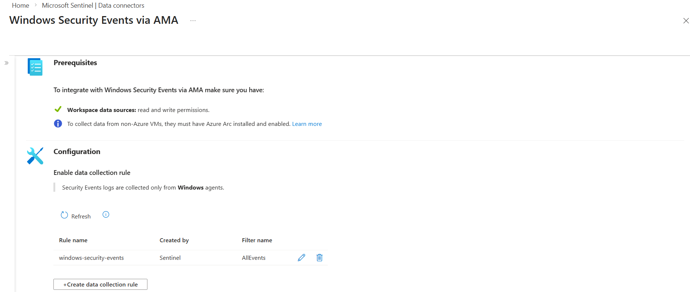
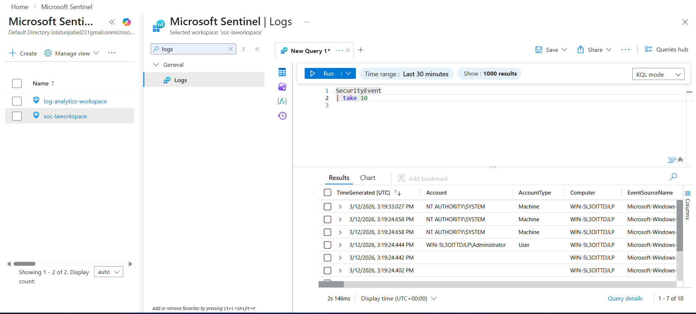

# Project 0 — SOC Environment Setup

## Objective
Establish a Microsoft cloud-based SOC environment aligned with the SC-200 exam.

---

## Focus Areas

- Identity setup (Microsoft Entra ID)
- Log ingestion
- SIEM enablement using Microsoft Sentinel

---

## Outcome

A functional **SOC Lab** ready for:

- Threat detection  
- Incident investigation  
- Security monitoring  
- Automation use cases  

---

## Environment Components

- Microsoft Entra ID (Identity)
- Azure Log Analytics Workspace
- Microsoft Sentinel (SIEM)

### Microsoft Entra ID Tenant

The Microsoft Entra ID tenant was used as the identity provider for the SOC lab environment.



---

### Users Created for the Lab

Test users were created within the tenant to simulate identity activity inside the SOC environment.



---

### Microsoft Sentinel Workspace Enabled

A Log Analytics Workspace was created and Microsoft Sentinel was enabled to function as the SIEM platform for the SOC lab.



---

## Status

Completed — SOC environment successfully configured and operational.


## Windows Server Onboarding to Microsoft Sentinel

### Overview

In this step of the SOC lab setup, a **Windows Server 2022 virtual machine running locally in VMware Workstation** was deployed and onboarded to Azure using **Azure Arc**.

This configuration allows Windows security logs from an **on-premises server** to be collected and sent to **Log Analytics Workspace**, where they can be accessed through **Microsoft Sentinel**.

This setup demonstrates how organizations connect **on-premises infrastructure to a cloud monitoring platform**.

---

### Lab Architecture

```text
Windows Server 2022 (VMware)
        ↓
Azure Arc
        ↓
Azure Monitor Agent
        ↓
Log Analytics Workspace
        ↓
Microsoft Sentinel
```

---

## 1. Deploy Windows Server in VMware

A Windows Server virtual machine was created using **VMware Workstation** to simulate an on-premises server environment.

### VM Configuration

- Operating System: Windows Server 2022  
- Memory: 16 GB  
- Processors: 4  
- Disk Size: 60 GB  
- Network Adapter: NAT  
- Platform: VMware Workstation 17.5.x  

### Installation Steps

1. Open **VMware Workstation**
2. Click **Create a New Virtual Machine**
3. Select **Installer Disc Image (ISO)**
4. Choose the **Windows Server 2022 ISO**
5. Configure VM resources:
   - 16 GB RAM
   - 4 CPUs
   - 60 GB disk
6. Configure **NAT networking**
7. Start the virtual machine
8. Complete the Windows Server installation wizard
9. Configure the **Administrator password**
10. Log in to the Windows Server environment

This virtual machine acts as a **local server generating Windows security event logs**.

---

## 2. Create Log Analytics Workspace

A **Log Analytics Workspace** was created in Azure to store logs collected from the Windows Server.

Steps:

1. Navigate to the **Azure Portal**
2. Search for **Log Analytics Workspaces**
3. Click **Create**
4. Configure:
   - Resource Group
   - Workspace Name
   - Region
5. Deploy the workspace

The workspace acts as the **central location where logs are stored**.

---

## 3. Enable Microsoft Sentinel

Microsoft Sentinel was enabled on the Log Analytics Workspace.

Steps:

1. Open **Microsoft Sentinel**
2. Click **Create**
3. Select the **Log Analytics Workspace**
4. Enable Sentinel

This allows logs stored in the workspace to be monitored from the Sentinel interface.

---

## 4. Onboard Windows Server Using Azure Arc

Since the Windows Server is running outside Azure, it was connected using **Azure Arc**.

Steps:

1. Navigate to **Azure Portal**
2. Go to **Azure Arc → Machines**
3. Click **Add / Connect Machine**
4. Generate the **PowerShell onboarding script**
5. Copy the script
6. Open **PowerShell as Administrator** on the Windows Server VM
7. Paste and run the onboarding script

The script installs the **Azure Connected Machine Agent** and registers the server with Azure.

After successful execution, the machine appears in:

```
Azure Arc → Machines
```

---

## 5. Configure Windows Security Event Collection

To allow the Windows Server to send logs to Azure:

1. Open **Microsoft Sentinel**
2. Navigate to **Data Connectors**
3. Select:

```
Windows Security Events via Azure Arc
```

4. Create a **Data Collection Rule (DCR)**
5. Configure the rule to collect:

```
All Security Events
```

This configuration enables Windows security events to be collected from the onboarded server.

---

## 6. Install Azure Monitor Agent

The **Azure Monitor Agent (AMA)** is deployed to the Windows Server through the Data Collection Rule.

Purpose of the agent:

- Collect Windows security event logs
- Send the logs to **Log Analytics Workspace**
- Make the logs available through **Microsoft Sentinel**

---

## Screenshots

### Windows Server VM Configuration


### Azure Arc Machine Connected


### Azure Monitor Agent Installed


### Windows Security Events Collected


### Security Logs Visible in Microsoft Sentinel



---

## SOC Lab Architecture

### On-Premises Environment (VMware)

```
Windows Server 2022 VM
        │
        │ Azure Arc Agent
        ▼
```

### Microsoft Azure

```
Azure Arc
        │
        ▼
Azure Monitor Agent (AMA)
        │
        ▼
Data Collection Rule
        │
        ▼
Log Analytics Workspace
        │
        ▼
Microsoft Sentinel (SIEM)
        │
        ▼
Security Event Analysis (KQL Queries)
```

---

## Tools Used

- VMware Workstation
- Windows Server 2022
- Microsoft Azure
- Azure Arc
- Azure Monitor Agent (AMA)
- Log Analytics Workspace
- Microsoft Sentinel
- Kusto Query Language (KQL)
---


