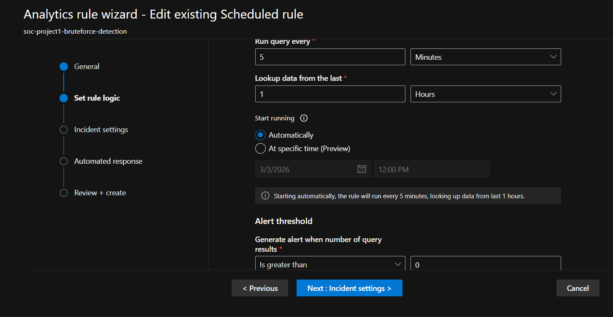
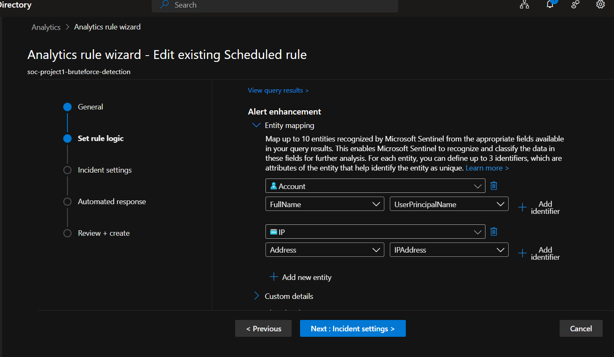
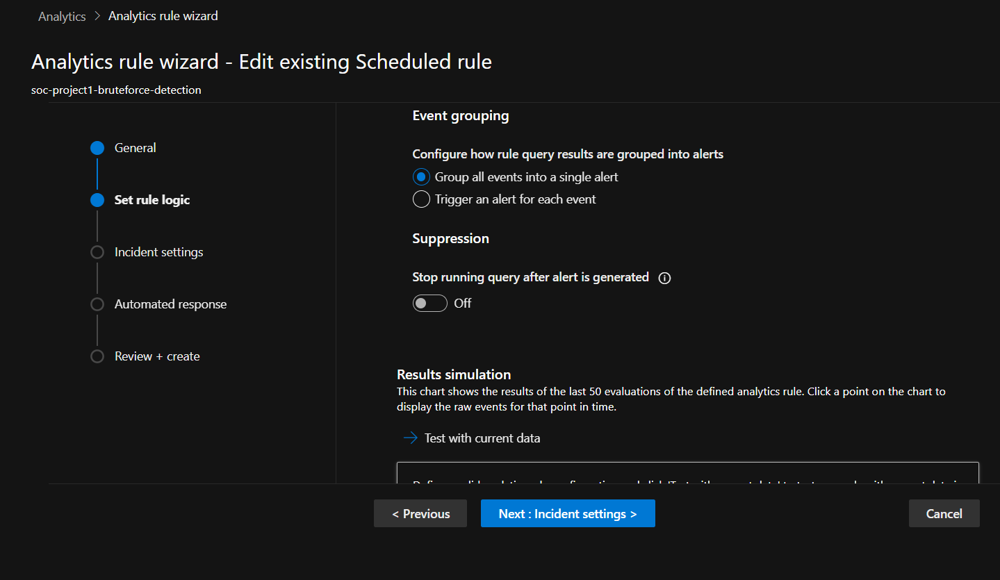
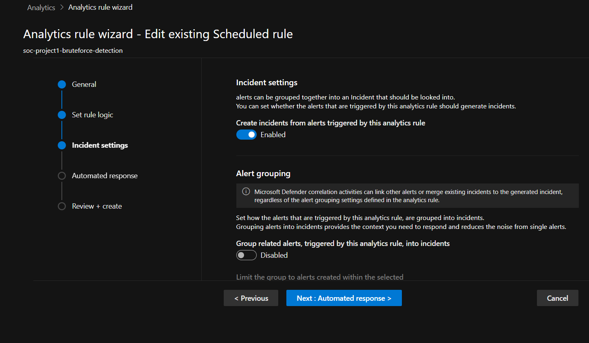

# Analytics Rule – Brute Force Detection

This rule was created in Microsoft Sentinel to detect repeated failed Azure AD sign-in attempts that may indicate a brute-force attack.

## Detection Logic

The rule monitors the `SigninLogs` table and triggers an alert when a user account receives 10 or more failed login attempts from the same IP address within 1 hour.

```kql
SigninLogs
| where TimeGenerated >= ago(1h)
| summarize 
    FailedAttempts = countif(ResultType != 0),
    SuccessfulAttempts = countif(ResultType == 0),
    FirstSeen = min(TimeGenerated),
    LastSeen = max(TimeGenerated)
    by UserPrincipalName, IPAddress
| where FailedAttempts >= 10

## Rule Configuration

- **Rule Type:** Scheduled Query Rule  
- **Runs every:** 5 minutes  
- **Lookback period:** 1 hour  
- **Alert trigger:** Results > 0  
- **Severity:** Medium

## Rule Configuration Screenshots


- **Technique:** T1110 – Brute Force  

## Entity Mapping

- **Account:** UserPrincipalName  
- **IP Address:** IPAddress

### 1. Rule Overview


### 2. Rule Logic & Scheduling


### 3. Entity Mapping


### 4. Event Grouping


### 5. Incident Settings


