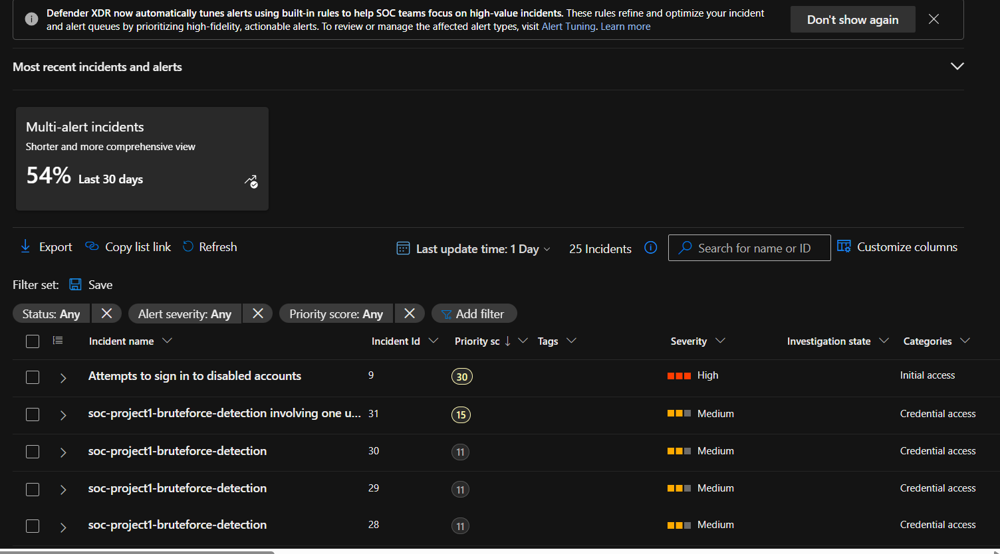
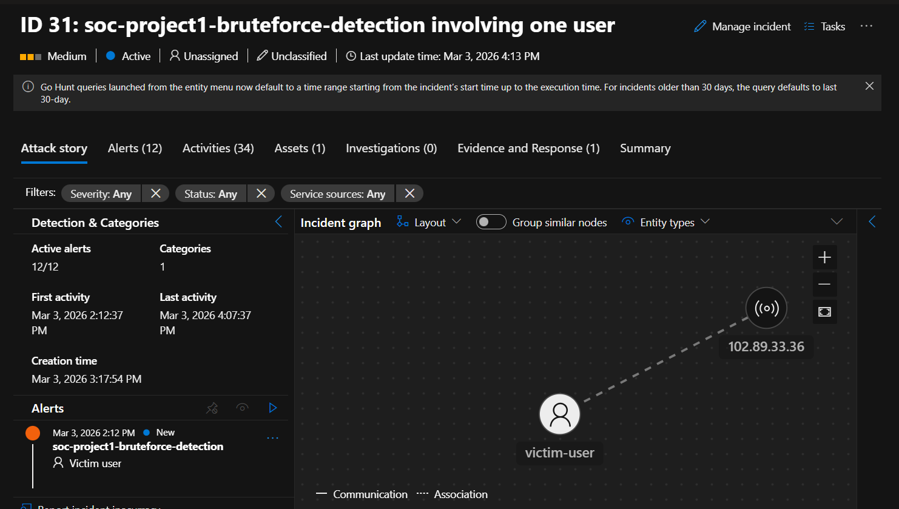
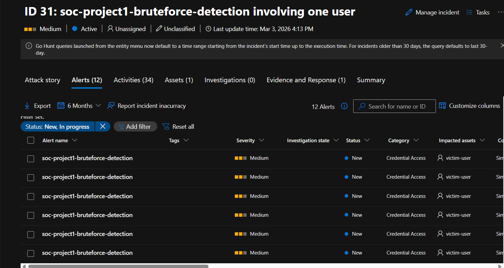
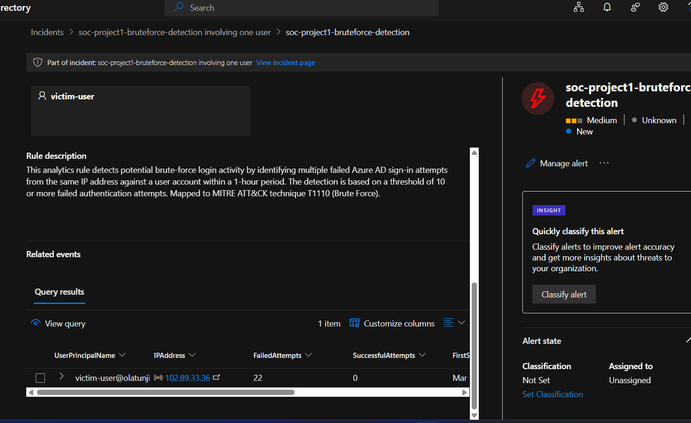
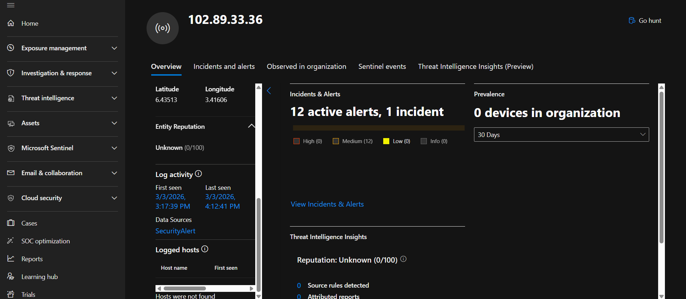

## Incident Investigation – Brute Force Login Attempts

### Overview

During this project, I investigated an alert generated by Microsoft Sentinel after multiple failed login attempts were detected against a user account. The analytics rule I created was designed to detect possible brute-force login activity based on repeated authentication failures from the same IP address.

The alert was grouped into an incident by Microsoft Defender, which allowed me to analyze all related alerts and entities in one place.

**Incident Name:** soc-project1-bruteforce-detection
**Severity:** Medium
**MITRE ATT&CK Technique:** T1110 – Brute Force

---

### Detection Logic

The detection rule monitors Azure AD sign-in logs and triggers an alert when a user account receives **10 or more failed login attempts from the same IP address within one hour**.

The query checks for authentication failures and summarizes the number of attempts per user and IP address.

```kql
SigninLogs
| where TimeGenerated >= ago(1h)
| summarize
    FailedAttempts = countif(ResultType != 0),
    SuccessfulAttempts = countif(ResultType == 0),
    FirstSeen = min(TimeGenerated),
    LastSeen = max(TimeGenerated)
    by UserPrincipalName, IPAddress
| where FailedAttempts >= 10
```

---

### Investigation Process

To investigate the alert, I performed the following steps:

1. Opened the incident in Microsoft Defender under **Investigation & Response**.
2. Reviewed the **Attack Story** graph to understand the relationship between entities involved in the alert.
3. Identified the targeted user account and the IP address responsible for the login attempts.
4. Examined the **alerts tab**, which showed multiple alerts generated from the same activity.
5. Reviewed the **query results** to confirm the number of failed login attempts.
6. Investigated the **IP entity page** to check the IP's reputation and activity within the environment.

---

### Investigation Findings

During the investigation I observed the following:

| Field                 | Value                     |
| --------------------- | ------------------------- |
| Target User           | victim-user               |
| Source IP Address     | 102.89.33.36              |
| Failed Login Attempts | 22                        |
| Successful Logins     | 0                         |
| Attack Type           | Brute Force Login Attempt |

The attack involved repeated login attempts from a single external IP address targeting the **victim-user** account. The activity matched the detection rule criteria and triggered multiple alerts that were grouped into one incident.

The query results confirmed that the attacker attempted to log in multiple times but **no successful authentication occurred**.

---

### Entity Correlation

Microsoft Sentinel automatically mapped entities from the query results.

The **Account entity** was mapped using the `UserPrincipalName` field and the **IP entity** was mapped using the `IPAddress` field.

This allowed Sentinel to display the relationship between the attacking IP and the targeted account in the **Attack Story graph**, making the investigation easier to understand.

---

### Conclusion

Based on the investigation, the activity appears to be a **brute-force password attack attempt** against the user account.

Although the attacker attempted multiple login attempts, none were successful and the account was not compromised.

This project demonstrates how Microsoft Sentinel can be used to detect suspicious authentication activity and how a SOC analyst can investigate alerts using entity correlation, alert evidence, and log analysis.

---

### Recommended Actions

* Continue monitoring login activity for the affected user account
* Enable or enforce **Multi-Factor Authentication (MFA)**
* Consider blocking or monitoring the source IP address if repeated activity occurs
* Maintain continuous monitoring of Azure AD sign-in logs

## 📸 Investigation Screenshots

The following screenshots document the full investigation workflow for the brute-force detection incident.

### 1. Incident Queue
Shows the SOC incident dashboard where multiple incidents are generated and prioritized.



---

### 2. Attack Story Graph
Displays the entity relationship between the targeted user account and the attacking IP address.



---

### 3. Alerts Generated
Shows multiple alerts triggered by the analytics rule due to repeated failed sign-in attempts.



---

### 4. Query Results
Displays the query output confirming the detection of multiple failed authentication attempts.



---

### 5. IP Entity Investigation
Shows investigation details for the source IP address involved in the brute-force activity.



---

## 🔍 Investigation Summary

These screenshots demonstrate the end-to-end SOC investigation process:

- Detection of suspicious activity using **KQL analytics rules**
- Alert generation from repeated failed authentication attempts
- Incident creation and triage in **Microsoft Defender / Sentinel**
- Entity correlation between **user account and IP address**
- Threat entity investigation of the **source IP address**

This investigation confirms a **potential brute-force login attempt** targeting a user account from a single external IP address.

