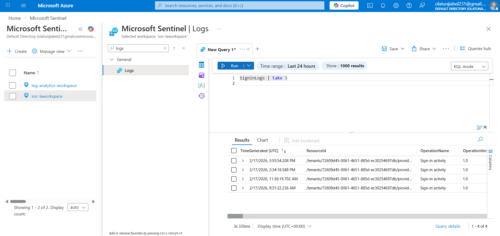

## Log Ingestion Verification

In this step, I verified that Microsoft Entra ID sign-in logs were successfully flowing into Microsoft Sentinel.

The data source used was **Microsoft Entra ID (Azure Active Directory) — Sign-in Logs**.

To confirm that log ingestion was working correctly, I ran the following KQL query:
SigninLogs
| take 5

This query returned recent sign-in records, confirming that authentication logs were being successfully collected in the Log Analytics workspace.

As a result, the SOC environment was confirmed to be receiving log data and was ready for detection and investigation activities.

## Evidence

The screenshot below confirms that Microsoft Entra ID sign-in logs were successfully ingested into Microsoft Sentinel.

