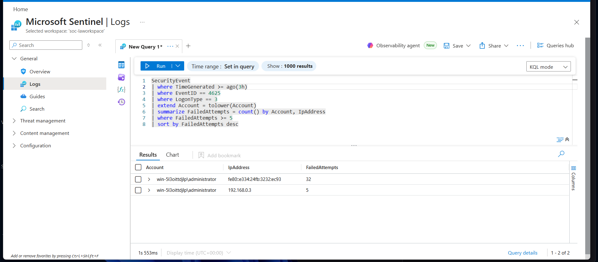
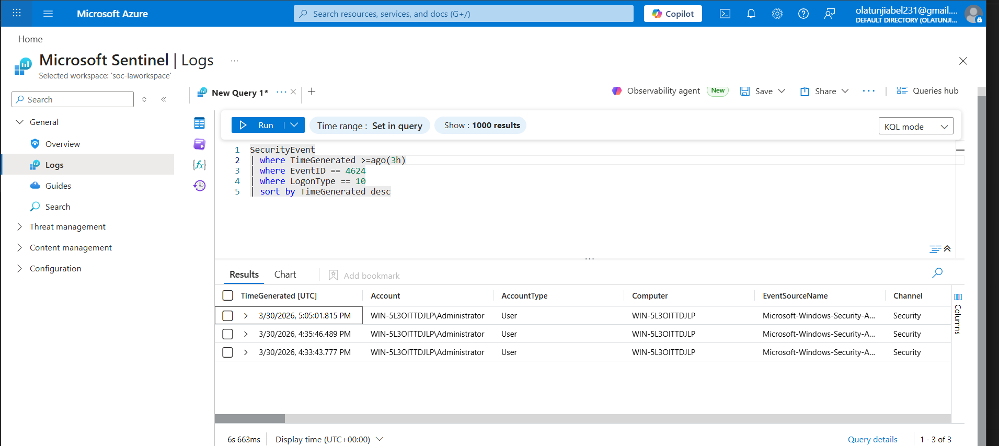
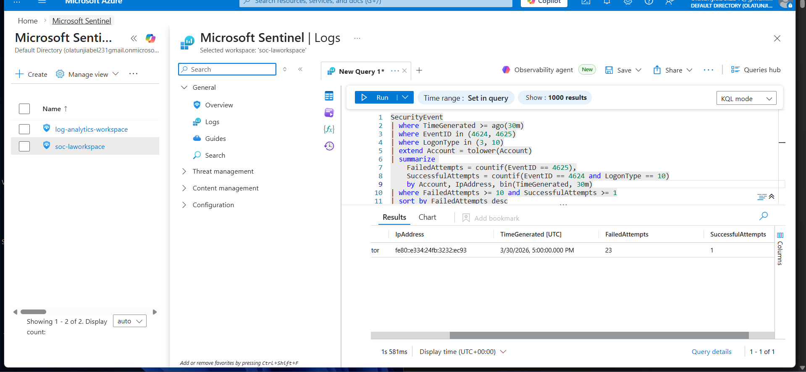
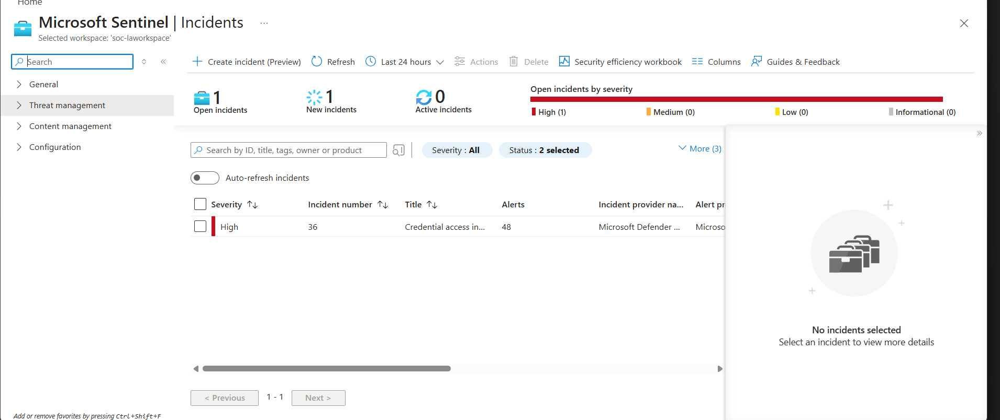
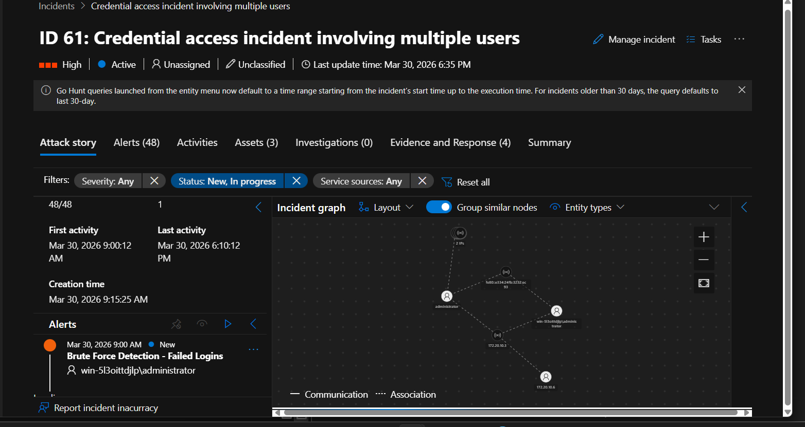

# Microsoft Sentinel SOC Lab – RDP Brute Force Detection & Investigation

## 🧠 Overview

This project is about detecting and investigating a brute force attack on a Windows Server using Microsoft Sentinel.

The idea is to monitor login activity and identify a situation where multiple failed login attempts are followed by a successful Remote Desktop (RDP) login within a short period of time.

---

## 🎯 Objective

The goal of this project is to:

- Simulate a brute force attack on a Windows Server  
- Build a detection rule using KQL  
- Detect multiple failed logins followed by a successful RDP login  
- Do all of this within a 30-minute window  

---

## 🏗️ Lab Architecture

The environment was set up like this:

Windows Server  
↓  
Azure Arc  
↓  
Azure Monitor Agent  
↓  
Data Collection Rule (DCR)  
↓  
Log Analytics Workspace  
↓  
Microsoft Sentinel  

This setup allows logs from the Windows Server to be collected and analyzed inside Sentinel.

---

## ⚔️ Attack Simulation

To simulate the attack:

- I connected to the Windows Server using RDP  
- I intentionally entered the wrong password multiple times  
- After several failed attempts, I entered the correct password  
- Then I successfully logged into the system  

At first, I didn’t realize that how I handled the RDP session would affect the logs, which later caused some confusion during detection.

---

## 📊 Logs Observed

During the simulation, the following logs were generated:

- Event ID 4625 → Failed login attempts  
- Event ID 4624 → Successful login  
- LogonType 3 → Network authentication attempts  
- LogonType 10 → Actual RDP login session  

Initially, I thought RDP would always show LogonType 10, but I later discovered that failed attempts were showing as LogonType 3 instead.

### 🔹 Failed Login Attempts


### 🔹 Successful RDP Login


---

## 🔍 Detection Logic

The detection rule is designed to catch:

- Multiple failed login attempts  
- Followed by a successful RDP login  
- Within 30 minutes  

### Threshold used:

- 10 or more failed attempts  
- At least 1 successful login  

---

## 🧾 KQL Query

```kql
SecurityEvent
| where TimeGenerated >= ago(30m)
| where EventID in (4624, 4625)
| where LogonType in (3, 10)
| extend Account = tolower(Account)
| summarize 
    FailedAttempts = countif(EventID == 4625),
    SuccessfulAttempts = countif(EventID == 4624 and LogonType == 10)
    by Account, IpAddress, bin(TimeGenerated, 30m)
| where FailedAttempts >= 10 and SuccessfulAttempts >= 1
| sort by FailedAttempts desc
```

### 🔹 Detection Result


---

## ⚙️ Analytics Rule

The detection query was used to create a scheduled analytics rule in Microsoft Sentinel.

### 🔹 Rule Configuration


---

## 🚨 Incident Creation

Once the rule was triggered, Microsoft Sentinel generated an incident.

### 🔹 Incident Created


---

## 🧪 Investigation

Inside the incident, I investigated the attack using the attack graph.

### 🔹 Attack Graph / Entities


From the investigation:

- Multiple failed attempts were observed from the same IP  
- The same account was targeted  
- A successful login occurred after the failed attempts  
- All activities were within a short timeframe  

---

## ✅ Conclusion

This project demonstrates how a brute force attack can be detected using Microsoft Sentinel by correlating failed and successful login events.

It also shows the importance of understanding log types (LogonType 3 vs 10) and how small details can affect detection results.

Through this lab, I was able to:

- Simulate a real attack scenario  
- Write and test KQL queries  
- Build a detection rule  
- Investigate an incident in Microsoft Sentinel  

---

## 💭 Personal Note

At first, I was confused when my detection didn’t work immediately.  

I later realized that the issue was related to time range and how login sessions were handled.  

Fixing that helped me better understand how logs are generated and how detection logic works in real scenarios.

This project really helped me move from just writing queries to actually thinking like a SOC analyst.
