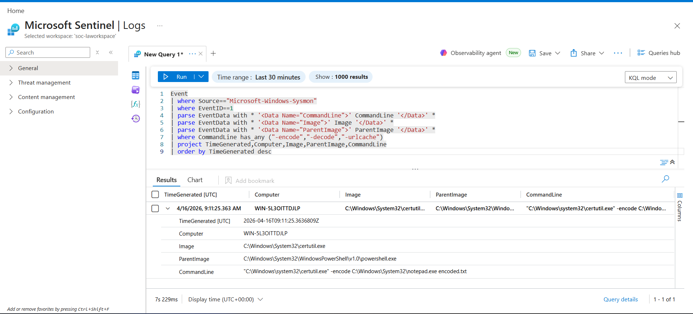
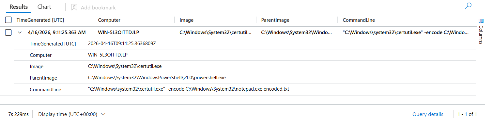

# Certutil Encoded Execution (LOLBIN Abuse)

## 📌 Attack Simulation

Certutil is one of Windows Process used basically for Manual verification of Digital certificate, it can be used to execute commands too and also download files.

Hackers usually take advantage of this Certutil that is part of the Microsoft LOLBIN to download malwares on a target computers, encode files as well. Hackers love to use this Certutil in the background to do all this because the computer firewall hardly block LOLBINS execution. So therefore Analysts sometimes needs to manually hunt for this threats.

I simulated a Certutil LOLBIN attack using Powershell to run the Certutil encoded command to encode `notepad.exe`. Then I wrote a KQL detection query to detect the CommandLine, Parent Image and Image.

---


## 📊 Log Source

* Sysmon (Event ID 1 – Process Creation)

---

## 🔍 Detection (KQL Query)

```kql
Event
| where Source == "Microsoft-Windows-Sysmon"
| where EventID == 1
| parse EventData with * '<Data Name="CommandLine">' CommandLine '</Data>' *
| parse EventData with * '<Data Name="Image">' Image '</Data>' *
| parse EventData with * '<Data Name="ParentImage">' ParentImage '</Data>' *
| where Image endswith "certutil.exe"
| where CommandLine has_any ("-encode", "-decode", "-urlcache")
| project TimeGenerated, Computer, Image, ParentImage, CommandLine
| order by TimeGenerated desc
```

---

### 📸 Detection Result



---

## 🧠 Investigation

The question is what is suspicious about Certutil running an encoded command right?

Well a normal user wouldn't know how to use Powershell let alone encoding commands. Moreover what is the use of hiding commands if it is legit.

So to investigate you look for:

* **CommandLine** — which shows the command used
* **Image** — which shows the process executed
* **Parent Image** — shows what executed the Image

In cases like this investigation must be done thoroughly, Parent Image and Image let you see properly if there is a C2 Beacon attack. LOLBIN is usually taken advantage of a lot by adversaries.

---

### 📸 Process Execution Evidence (Parent-Child Relationship)



---

## 🔄 SOC Workflow

When stuffs like this happen in a SOC Environment, it's triage first which is verifying the Alert, then investigate by using the SIEM tool like Microsoft Sentinel to see what has been done.

**1. Triage**
* Verify the alert

**2. Investigation**
* Use Microsoft Sentinel to see what has been done
* If any encoded command was done, you can go ahead and decode it to see what was done

**3. Containment**
* If it's a malware download, immediately check if it's not spreading across the network
* If it is spreading, disconnect it from the network

**4. Remediation**
* Use anti malware to scan e.g Defender for Endpoints
* Microsoft Intune lets you know if the device health is safe to connect back

**5. Reporting**
* Write a report about your findings
* Escalate to the IT department if necessary

---

## 🚨 Response Actions

* Device isolation
* Process termination
* Blocking suspicious Certutil usage
* Full endpoint malware scan

---

## 🎯 MITRE ATT&CK Mapping

* Technique: **T1140 – Deobfuscate/Decode Files or Information**
* Technique: **T1105 – Ingress Tool Transfer**
* Tactic: **Defense Evasion / Command and Control**

