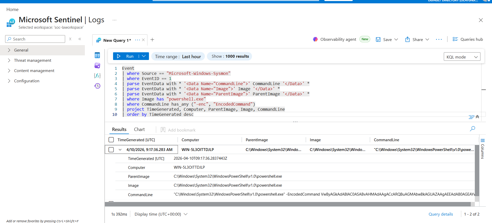
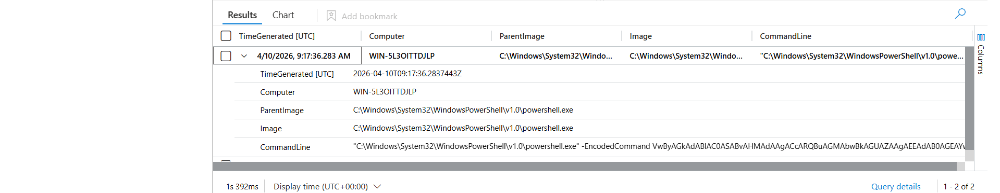

# PowerShell Encoded Command Execution (LOLBIN Abuse)

## 📌 Attack Simulation
In this simulation, I used `powershell.exe` to execute an **encoded command**.

The goal was to mimic how attackers hide what they are doing by encoding their commands.

A normal user would not have any reason to encode commands before executing them. This makes encoded PowerShell activity suspicious.

Attackers commonly use PowerShell encoding to:
- Hide malicious scripts  
- Obfuscate payloads  
- Bypass basic detection mechanisms  

---

## 📊 Log Source
- Sysmon (Event ID 1 – Process Creation)

---

## 🔍 Detection (KQL Query)

Detection was performed using a KQL query to identify PowerShell executing encoded commands.

➡️ [View Detection Query](../queries/powershell-encoded-detection.kql)

```kql
Event
| where Source == "Microsoft-Windows-Sysmon"
| where EventID == 1
| parse EventData with * '<Data Name="CommandLine">' CommandLine '</Data>' *
| parse EventData with * '<Data Name="Image">' Image '</Data>' *
| where Image has "powershell.exe"
| where CommandLine has_any ("-enc","EncodedCommand")
| project TimeGenerated, Computer, Image, CommandLine
| order by TimeGenerated desc
```

---

## 📸 Detection Result


---

## 🧠 Investigation

From the logs, I observed that:

- `powershell.exe` was executed on the endpoint  
- The command line contained an **encoded command**  
- Sysmon also showed the **parent process** and execution details  

This is suspicious because:
- Encoded commands are not normal user behavior  
- Attackers use encoding to hide their activity  

Key findings:
- Presence of `-enc` or `EncodedCommand` in command line  
- Execution of PowerShell with hidden payload  
- Potential malware or script execution  

---

## 📸 Process Execution Evidence


---

## 🔄 SOC Workflow

**1. Detection**  
- Suspicious PowerShell execution identified  

**2. Triage**  
- Verified affected system and timestamp  

**3. Investigation**  
- Checked command line and process details  
- Confirmed encoded command usage  

**4. Containment**  
- Isolated endpoint (if malicious)  
- Terminated PowerShell process  

**5. Remediation**  
- Scanned system using security tools  
- Removed any malicious payload  

**6. Recovery**  
- Restored system and monitored activity  

**7. Reporting**  
- Documented findings and actions taken  

---

## 🚨 Response Actions
- Device isolation  
- Process termination  
- Full malware scan using security tools (e.g., Defender for Endpoint)  
- Review system for persistence mechanisms  

---

## 🎯 MITRE ATT&CK Mapping

- Technique: **T1059.001 – PowerShell**  
- Tactic: **Execution / Defense Evasion**  

This technique involves abusing PowerShell to execute encoded or obfuscated commands.
